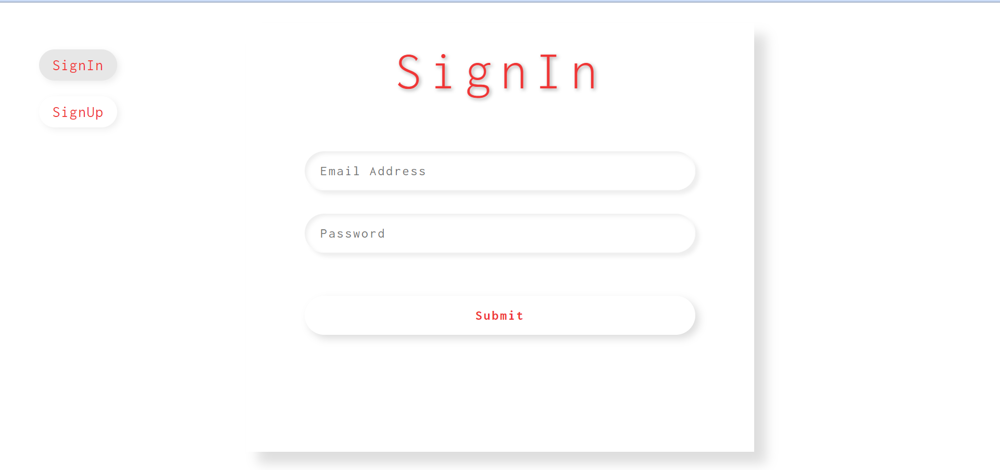

# form_with_validation

## Description
A responsive form with a sign in or sign up buttons.  By default the the page is set to sign in, and the user needs to enter there email and password.  By clicking on the sign up button more input fields are revealed which ask the user to input their name, email, password and to confirm their password.  If the user does not fill out all the required inputs and tries to submit the form error messages appears informing the user to fill in the required fields.  If the user does not enter an email in the correct format i.e. username@gmail.com the form will not submit and an error message will appear advising the user to enter a correct email. A regular exptression is used to make sure that the users email follows the correct email pattern.  If the user on the signup page does not confirm their password the form will not allow submit.  The user password and the user confirmation password must match.

## Demo
A demo for the project cna be found at: https://tod619.github.io/form_with_validation/